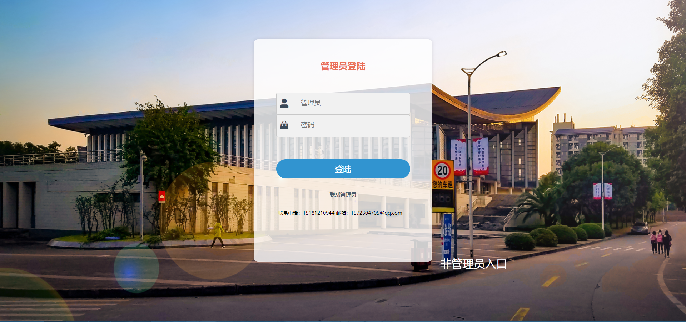
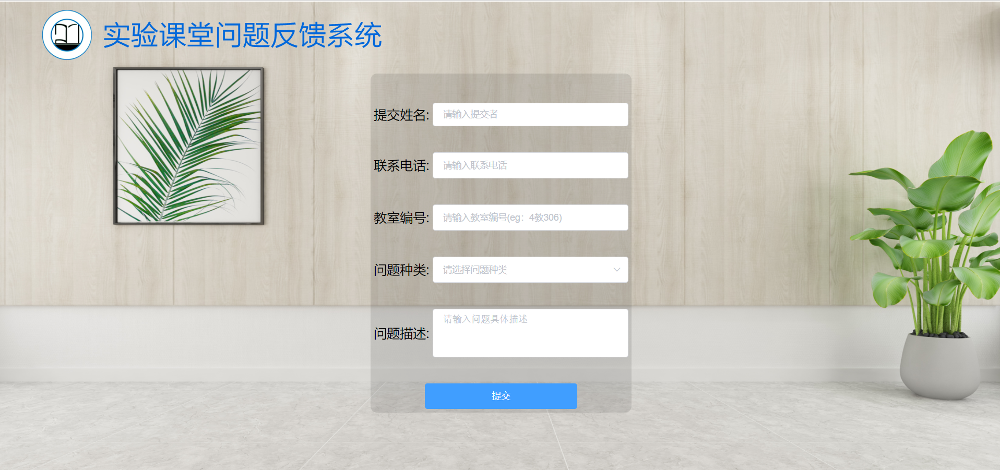

# 实验室的项目

## 安装项目依赖
```
npm install
```

### 运行项目
```
npm run serve
```

### 打包上线
```
npm run build
```

### 测试项目
```
npm run test
```

### 代码规范检查
```
npm run lint
```
## 项目概述

学校机房报修系统前端部分

### 项目目录结构
+ public
  - favicon.ico
  - index.html
+ src
  - assets 静态文件：图片和css文件
  - common 公共JS文件
  - components 公共组件
    - common 通用组件，可供其他项目使用，本案例有输入框组件
    - content 项目组件，只供本项目使用,有头部header区域的图片组件的问题提交的提交区域大组件
  - network 网络请求模块，目前没有联调，本文件夹为空
  - router 路由模块
  - store 状态管理模块
  - views 供router展示的页面组件
  - App.vue 根组件
  - main.js 入口文件
  
### 部分页面展示
管理员登陆：

问题提交：


### 成员协作须知
把展示页面写到views文件夹
eg：
你要写问题展示页面，在views文件夹新建Problem.vue文件，在template标签内写html结构，在style写样式，如果不会scss，把
style标签的lang="scss"删掉用css写就行
再在components的content文件夹写组件，写完在Problem.vue文件引入就行
